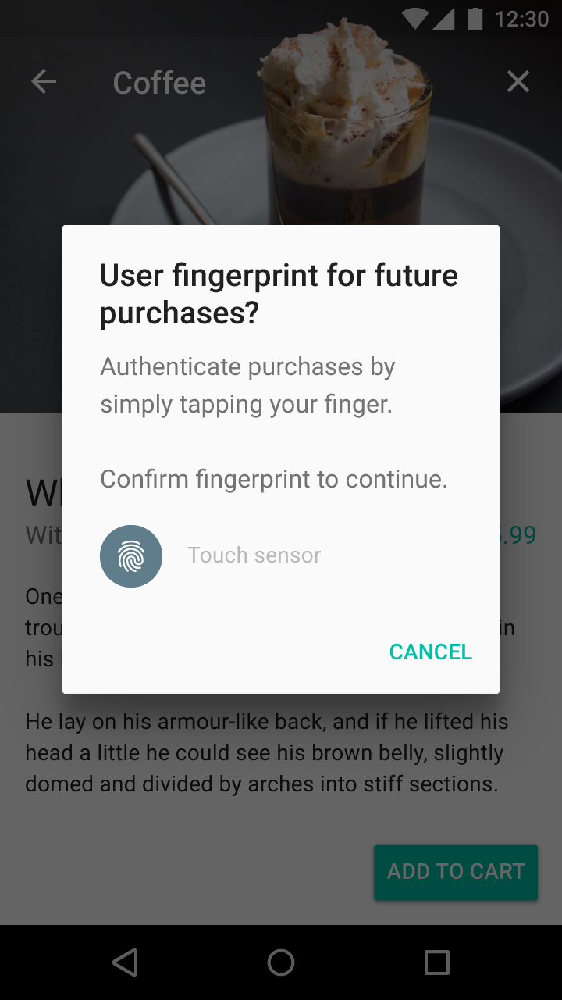
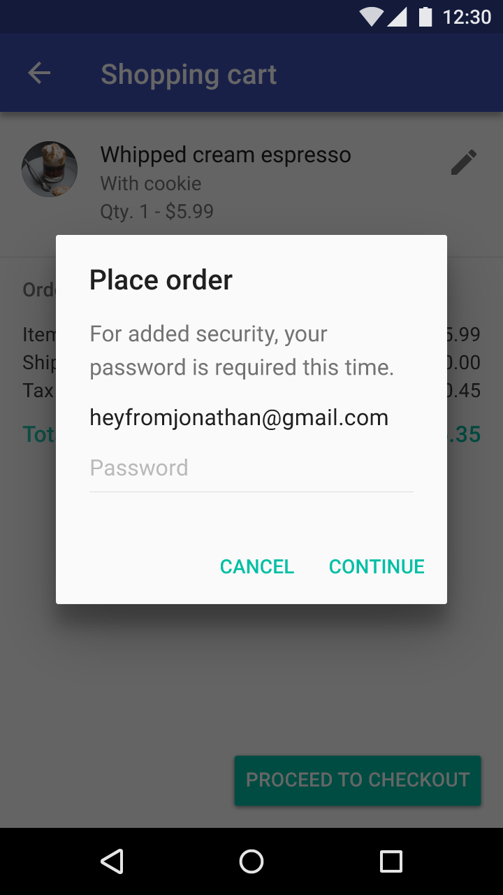
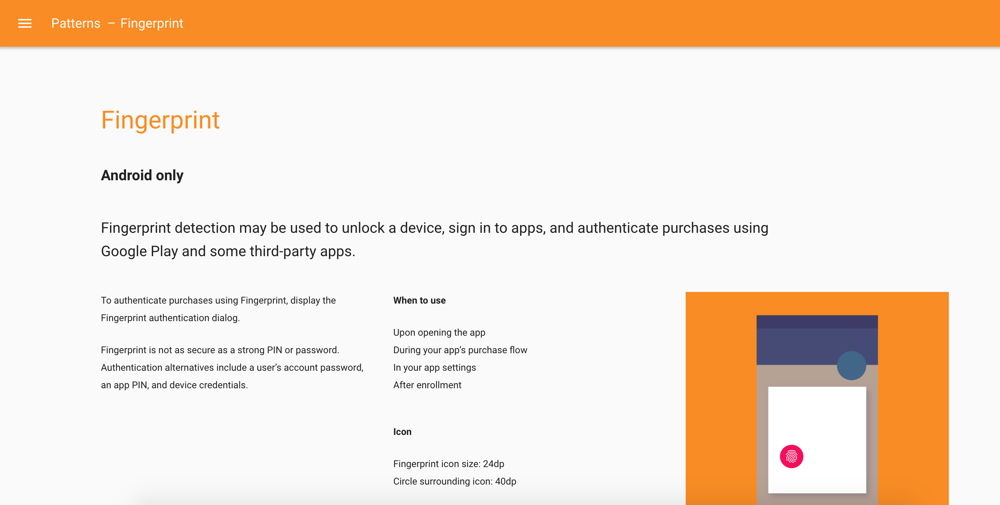

# Android Fingerprint Authentication In Action

## Ben Oberkfell

### @benlikestocode
### http://benlikestoco.de

---


---


---


# Real One Star Reviews From Real People

* When is the fingerprint update coming?

* It is inconvenient for me to enter my long password with lower, uppercase letters and numbers every time.

* Please add touch ID authentication. I am sick and tired of entering my password 10 times in a day.

---

# [fit]Bottom Line
# [fit]This stuff is becoming table stakes, so let's learn how to do it!

---

## Where Would You Want To Use Fingerprint?

---

## Logins

### Save the Trouble of Entering Passwords

---

## Protect Critical User Flows

### Things that Cost Money, Personal Security, etc

---

# The Hard Part

## How Do You Communicate a Successful Fingerprint Scan?

---

# Would You Trust This?   

```javascript
POST /dominos
{
    "item": "Pepperoni Pizza",
    "quantity": 500,
    "deliveryAddress" : "1600 Pennsylvania Avenue",
    "fingerprintValidated" : true
}
```

If the goal is to protect the order flow, nope! :pizza:

---


---

# What's In The Fingerprint Scanner?
If a device has a fingerprint reader and provides a developer-facing API, it... 
> MUST have a hardware-backed keystore implementation, and perform the fingerprint matching in a Trusted Execution Environment (TEE) or on a chip with a secure channel to the TEE.
-- Android 6.0 Compatibility Definition Document

---

# What Does This Mean For Us?

We can create encryption keys where the key cannot be used without authenticating with the fingerprint reader. 

---

# What Does This Mean For Us?

We can create encryption keys where the key cannot be used without authenticating with the fingerprint reader.

... which means if we can use the key, we know we successfully scanned an authorized fingerprint. 

---

# What Does This Mean For Us?

We can create encryption keys where the key cannot be used without authenticating with the fingerprint reader.

... which means if we can use the key, we know we successfully scanned an authorized fingerprint. 

... so how do we use this for authentication?

---

# Step 1
## Create a Public/Private Key Pair
### Make it require authentication
---

# Step 2
## Register the Public Key with Your Backend
### And associate it with your user
---

# Step 3
## Sign Your Critical Requests with the Private Key

---

# Step 4
## Your Backend Verifies the Signed Request

---

#Create the Key Pair

```java

keyPairGenerator = KeyPairGenerator.getInstance(KeyProperties.KEY_ALGORITHM_RSA, "AndroidKeyStore");
keyPairGenerator.initialize(
            new KeyGenParameterSpec.Builder("DemoKey", PURPOSE_SIGN)
                    .setKeySize(2048)
                    .setDigests(DIGEST_SHA256)
                    .setSignaturePaddings(KeyProperties.SIGNATURE_PADDING_RSA_PKCS1)
                    // Here's the most important part. This enforces authentication before the private
                    // key can be used.
                    .setUserAuthenticationRequired(true)
                .build());

keyPairGenerator.generateKeyPair();

```            

---

#Signing A Request

```java
public String signString(String data) {
    KeyStore keyStore = KeyStore.getInstance("AndroidKeyStore");
    keyStore.load(null);
    PublicKey publicKey = keyStore.getCertificate(KEY_NAME).getPublicKey();
    PrivateKey privateKey = keyStore.getKey(KEY_NAME, null);
    
    Signature signature = Signature.getInstance("SHA256withRSA");
    signature.initSign(getPrivateKey());   
    signature.update(dataToSign.getBytes("UTF8"))

    byte[] bytes = cryptoObject.getSignature().sign();
    return Base64.encodeToString(bytes, Base64.NO_WRAP);
}

```

... but this won't work since we're not authenticated

---

#Authenticating First

Some Prereqs

* We'd use the `FingerprintManager` class to manage the fingerprint sensor.
* But to make life easy for pre-API 23, use `FingerprintManagerCompat`.
* Call for the `USE_FINGERPRINT` permission in your manifest.  It'll be auto-granted.

---

#Authenticating First

```java

public void requestFingerprintAuth(Signature signature, 
                                   FingerprintManagerCompat.AuthenticationCallback callback) {

    CryptoObject cryptoObject = new CryptoObject(signature);
    CancellationSignal cancellationSignal = new CancellationSignal();

    FingerprintManagerCompat fingerprintManager = FingerprintManagerCompat.from(context);

    fingerprintManager.authenticate(cryptoObject, flags, cancellationSignal, callback, null); 

}
``` 

---

#Authenticating First

* This will start the scanner listening for fingerprints.
* `CryptoObject` wraps your crypto purpose (signing, encrypting, or message authentication code)
* `CancellationSignal` is a means of telling the fingerprint scanner to stop listening 
* __Stop listening__ when your app is not foregrounded & active. You can interfere with other apps or the lock screen if you keep listening.

---

#Reacting to Successful Authentication

```java
FingerprintManagerCompat.AuthenticationCallback callback = 
    new FingerprintManagerCompat.AuthenticationCallback() {        
            @Override
            public void onAuthenticationSucceeded(FingerprintManagerCompat.AuthenticationResult result) {
                super.onAuthenticationSucceeded(result);
                CryptoObject cryptoObject = result.getCryptoObject();

                // NOW we can use this Signature to sign!
                Signature signature = cryptoObject.getSignature();
            }

            // ....
}
```

---

#Reacting to Unsuccessful Authentication

There are two classes of unsuccessful authentication.

* Hard errors. If you get one of these, the scanner gives up.  Typically these are hardware or fingerprint lockout errors.
* Soft errors. These can be recovered from (unrecognized fingerprint, dirty sensor, moved too fast ... )
* You get callbacks that give a message ID (which is referred to by a constant) and also some help/error text text.

---

#Unsuccessful Authentication

```java
FingerprintManagerCompat.AuthenticationCallback callback = 
    new FingerprintManagerCompat.AuthenticationCallback() {

        // ....
            // Bad Fingerprint
            @Override
            public void onAuthenticationFailed() {
                super.onAuthenticationFailed();
                fingerprintView.onError("Fingerprint Not Recognized");
            }

            // Hard Error
            public void onAuthenticationError(int errMsgId, CharSequence errString) {
                super.onAuthenticationHelp(errMsgId, errString);
                if (!canceled) {
                    fingerprintView.onError(errString.toString());
                }
            }

            // Soft Error
            @Override
            public void onAuthenticationHelp(int helpMsgId, CharSequence helpString) {
                super.onAuthenticationHelp(helpMsgId, helpString);
                if (!canceled) {
                    fingerprintView.onError(helpString.toString());
                }
            }
    }
}
```

---

# Okay, so we can scan fingerprint and sign things.
## How does that help us?

---



# Register the Public Key With Your Backend

Simple example

```javascript
{
    'registerRequest' : {
        'username' : 'jdoe',
        'password' : 'p4ss4w0rd',
        'timestamp' : 1474000105154,
        'publicKey' : 'PUBLIC_KEY_BASE_64'
    },
    'signature' : 'SIGNATURE_BASE_64'
}
```

---

# Register the Public Key

Be sure to sign your registration request, and validate it in the backend, to prove the user has the  ownership of the private key and can use it.

You may need to transform the username and password into a "canonical" string suitable for signing.  Whatever you choose to do, do it the same on the backend.

---

# Now Make Protected Requests

```javascript
{
    'purchaseRequest' : {
        "item": "Pepperoni Pizza",
        "quantity": 500,
        "deliveryAddress" : "1600 Pennsylvania Avenue",
        "fingerprintValidated" : true
        'timestamp' : 1474000105154,
    },
    'signature' : 'SIGNATURE_BASE_64'
}
```

If the signature validates against the data provided, then you know the user applied their fingerprint successfully.

---


#Preventing Replay Attacks

Use a cryptographic "nonce."

The timestamp in the request prevents replaying the same request later.  Tampering with the timestamp would invalidate the signature.

You could also use other business data available to you if you can verify that the value hasn't been used multiple times.

---



#Handling Key Invalidation

* If the device has its lockscreen disabled or a new fingerprint is added, all authenticated keys are invalidated.
* Attempting to prepare a `Signature` with such a key will result in an `InvalidKeyException`.
* Don't use the key anymore. You have to re-create a new keypair and enroll it in your backend.

---

#Be Friendly

You should still _allow_ the user to use their password in lieu of fingerprint.  Put a "Use Password" button in the fingerprint dialog.

---

#Now onto UI

---



---


---

# Important to know

* Use the phrase "confirm fingerprint." It's what's used elsewhere.
* Take the error messages from Android for consistency sake.
* Users will be told to expect the fingerprint symbol. Display it as a standard icon (40dp circle with 24dp image). 

---

# Other Important Takeaways We Learned

* The "blessed" `CryptoObject` from the `FingerprintManager` success callback can be used only once.
* We needed to post that back to the main thread before we oculd use the `CryptoObject`.
* Use `FingerprintManagerCompat`!

---

# Questions?
## Thank You!

---

# Image Credits (Creative Commons)

* Nexus 6p https://flic.kr/p/C7keQW
* Notary Embosser https://flic.kr/p/dNMmAi